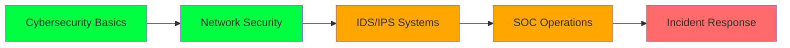

<div align="center">

# 👋 Hi, I'm Ashish Kumar


[](https://github.com/Ashiii27)
[](https://tryhackme.com/p/Ashiii27)

</div>

---

## 🎯 About Me

```python
class CyberSecurityStudent:
    def __init__(self):
        self.name = "Ashish Kumar"
        self.education = "B.Tech in Computer Science & Engineering"
        self.role = "Cybersecurity & Network Security Enthusiast"
        self.motto = "Learning by doing — breaking things ethically to make them more secure"
        self.approach = "Understand how attacks work to build better defenses"
        
    def current_focus(self):
        return [
            "Cybersecurity fundamentals & real-world attack vectors",
            "Network Security & Intrusion Detection Systems (IDS)",
            "Remote Login Security (Windows & Linux)",
            "SOC fundamentals & log analysis",
            "Ethical Hacking & Blue Team concepts"
        ]
    
    def philosophy(self):
        print("The best way to learn security is to understand how systems fail. 🔍")

me = CyberSecurityStudent()
me.philosophy()
```

<div align="center">

### 🛡️ *"Consistency > Perfection"*
*Passionate about securing systems and solving real-world cybersecurity problems*

</div>

---

## 🔐 What I'm Focused On

<table>
<tr>
<td width="50%">

### 🎯 Core Areas
- 🔒 Cybersecurity fundamentals & attack vectors
- 🌐 Network Security & IDS/IPS
- 🖥️ Remote Login Security (Windows & Linux)
- 📊 SOC fundamentals & log analysis
- 🛡️ Ethical Hacking & Blue Team concepts

</td>
<td width="50%">

### 📚 Currently Learning
- 🚨 SOC workflows & alert triaging
- 🔍 Advanced IDS techniques
- 📝 Windows event log analysis
- 🔧 Security automation with Python
- 🌐 Advanced network forensics

</td>
</tr>
</table>

---

## 🛠️ Skills & Tools

### 🔐 Cybersecurity & Networking


**Core Competencies:**
- TCP/IP Protocol Analysis
- DNS & HTTP/HTTPS Security
- Firewall Configuration & Management
- Intrusion Detection/Prevention Systems
- Authentication & Access Control

### 🧰 Tools & Platforms


**Toolkit:**
- 🐧 Linux (Ubuntu/Kali) - System Administration & Security
- 🦈 Wireshark - Network Protocol Analysis
- 🗺️ Nmap - Network Discovery & Security Auditing
- 🔌 Netcat - Network Troubleshooting & Testing
- 🎮 TryHackMe - Hands-on Cybersecurity Labs
- 🔧 Git & GitHub - Version Control & Collaboration

### 💻 Programming & Scripting


**Development Skills:**
- 🐍 Python - Security scripting & automation
- 📜 Bash - Linux system scripting (basic)

---

## 📂 Featured Projects

<div align="center">

### 🚀 Building Real-World Security Solutions

</div>

<table>
<tr>
<td width="50%">

### 🔹 Remote Login Intrusion Detection System
**Detects suspicious login attempts using logs and rule-based analysis**

🔧 **Tech Stack:** Python, Linux logs, Networking

📌 **Features:**
- Log parsing and analysis
- Suspicious pattern detection
- Rule-based alert system
- Real-time monitoring capabilities

</td>
<td width="50%">

### 🔹 Network Traffic Analysis
**Analyzed packet captures to identify malicious patterns**

🔧 **Tech Stack:** Wireshark, TCP/IP

📌 **Highlights:**
- Deep packet inspection
- Protocol analysis
- Malicious traffic identification
- Network forensics techniques

</td>
</tr>
</table>

### 🔹 Cybersecurity Mini Labs
**Hands-on labs covering scanning, enumeration, and traffic inspection**

- 🎯 Port scanning and service enumeration
- 🔍 Network reconnaissance techniques
- 📊 Traffic analysis and pattern recognition
- 🛡️ Basic vulnerability assessment

<div align="center">

**➡️ More projects coming soon — always building 🚀**

</div>

---

## 📊 GitHub Stats

<div align="center">
  
  
</div>

<div align="center">
  
</div>

<div align="center">

### 💡 My Approach
**Actively pushing security-related projects** • **Focus on quality documentation** • **Consistency > Perfection**

</div>

---

## 🎓 Learning Journey



**Legend:** 🟢 Completed | 🟡 In Progress | 🔴 Next Goal

---

## 🏆 Certifications & Practice Platforms

<div align="center">

| Platform | Status | Focus Area |
|:--------:|:------:|:----------:|
|  | Active | Practical Labs & Challenges |
|  | In Progress | Security Fundamentals |
|  | Focused | Defensive Security |

[🎯 Visit My TryHackMe Profile](https://tryhackme.com/p/Ashiii27)

</div>

---

## 💡 Security Philosophy

<div align="center">

> *"The best way to learn security is to understand how systems fail."* 🔍

</div>

### 🎯 My Principles
- 🔐 **Learn by Doing** - Hands-on practice beats theory
- 🛡️ **Blue Team Mindset** - Think defense, understand offense
- 📊 **Document Everything** - Knowledge shared is knowledge multiplied
- 🔄 **Continuous Learning** - Security never stands still
- 🤝 **Ethical Always** - Break things ethically to build them stronger

---

## 🔧 Current Tech Stack

<div align="center">

```text
Operating Systems:  Linux (Ubuntu/Kali), Windows
Analysis Tools:     Wireshark, Nmap, Netcat
Languages:          Python, Bash
Focus Areas:        Network Security, IDS, SOC Operations
Learning Platform:  TryHackMe, Hands-on Labs
```

</div>

---

## 📈 Contribution Activity

<div align="center">


</div>

---

## 🤝 Let's Connect

<div align="center">

[](https://github.com/Ashiii27)
[](https://tryhackme.com/p/Ashiii27)
[](https://linkedin.com/in/YOUR_LINKEDIN)
<! [](mailto:your.email@example.com) !>

</div>

---

## 🎯 2026 Goals

- ✅ Build hands-on security projects
- 🔄 Master SOC fundamentals & log analysis
- 🔄 Advance in TryHackMe ranking
- 📝 Complete Blue Team learning path
- 🎓 Earn Security+ certification
- 🚀 Contribute to open-source security tools

---

<div align="center">

### 🌟 "Building a Safer Digital World, One Project at a Time"

**⭐ Feel free to explore my repositories and drop a star if you find something useful! ⭐**

<sub>💻 Security Projects | 🛡️ Network Defense | 📚 Continuous Learning</sub>

---


</div>
